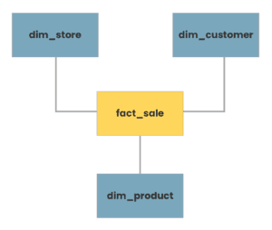
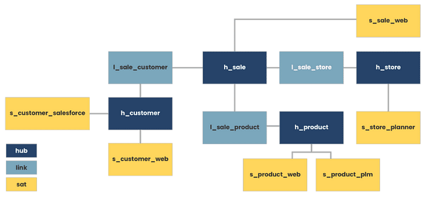
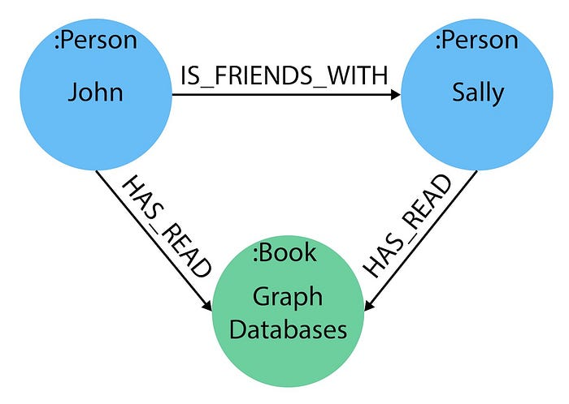
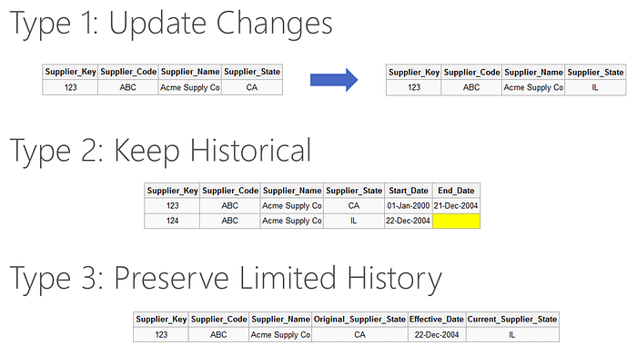
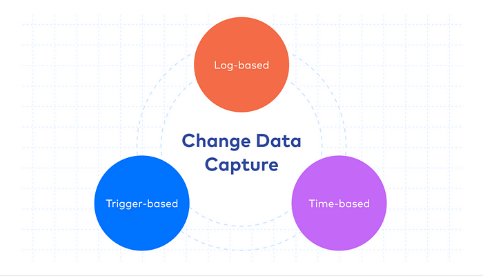

# 1. What is Data Modeling?
- process of conceptualizing and visualizing how data will be captured, stored, and used by an organization. 
- The ultimate aim of data modeling is to establish clear data standards for your entire organization.

## 3 main types of Data Models

- *Conceptual Data Model*: 
    - communicate with stakeholders showing relationships between different entities and defining their essential attributes according to the business requirements
    - represented by ER or UML diagrams
- *Logical Data Mode;*: 
    - refined versions of conceptual data models and incorporate details of cardinality, data types, constraints, validation as proposed by business rules
    - also defined using ER/UML diagrams
- *Physical Data Model*:
    - final version of logical data model which includes all technical features & limitations of the storage option you decide upon
    - specifically optimized for performance, scalability, security, avalability of your data

## Data Modeling techniques
- **Dimensional data modeling**: used for data analytics in Data Warehouses and organizing your data into facts (numerical measures of business events- sales,profit) and dimensions(descriptive attributes that provide context about the fact-order, customer).

- **Data vault data modeling**: enables quick integration of new data sources into existing models
    - insert-only architecture and allows historical record tracking
    - 3 components:
        - a hub (core business entity and unique keys defining it) 
        - a link (relation ship between business keys of 2 or more hubs)
        - a satellite (houses all contextual data about an entity)
        
- **Graph data modeling**: model made for graph databases that represent data that is the form of networks like social media interactions
    - nodes (entities), properties (attributes), edges (relationships)
    

## Important data modeling challenges
- **Normalization/Denormalization**: process of transforming a database to reduce redundancy and increase data integrity and consistency
    - need to apply partitions to a database to make each table simpler with a unique key and clearly defined dependencies to avoid any insert, update or delete errors
    - help to save storage by reducing redundancy and allow data flexibility, scalability, accuracy to make changes without affecting other tables
    - **NOTE**: But this may cause poor performance in retrieving queries through complex joins especially with distributed or large databases. Hence, we could use denormalization to provide quicker retrievals. Although, this would increase the risk of inconsistencies, we need to strike a balance between the two.

- **Slowly changing dimension**: dimension that stores and manages both current and previous version over a history of time period in a data warehouse.
    1. Update changes
    2. Keep Historical
    3. Preserve Limited History
    
- **Change data capture**: process of tracking changes in a database and then capturing them in destination systems
    - keeps all systems in sync and provides reliable data replication with zero downtime data migrations
    
    - get the changes from the log, time or trigger and load and refresh only the changed data